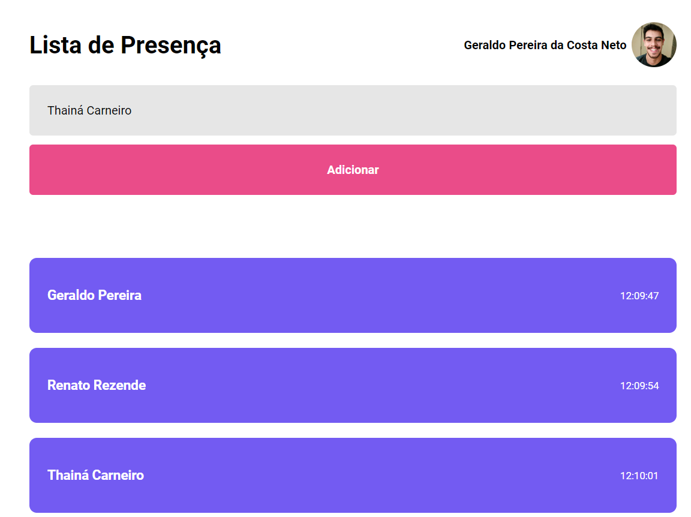

# Lista de Presença com ReactJS e API do GitHub

## Projeto feito com as aulas da <a href="https://www.rocketseat.com.br/discover" target="_blank"><i>RocketSeat</i></a>

### O Nome e a foto são dados retirados da API do github por meio do "useEffects"

<hr> 



<hr> 


# Install
Clone this repository and install it dependencies with this command: 
```sh
$ npm install
```

# Running
Run the application with `npm run dev` command, it will start the app:
```sh
$ npm run dev


